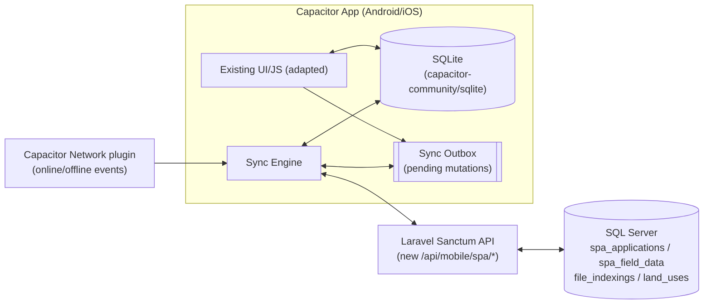

# SPAS Mobile — Offline-First (Capacitor + SQLite) Sync Plan

> **Status: Phase 0 complete (2026-08-16).** `SpaMobileService` exists and both
> Blade forms now write through it; the 13 `/api/spas/*` routes are registered;
> the `client_uuid` DDL is applied on dev. Phases 1–2 (Capacitor shell + local
> SQLite) are delegated to the build machine — see `AGENT_BRIEF.md` in the SPAS
> APK folder. Phases 3–6 not started.
>
> **Last revised 2026-08-16** — see §13 and §15.

## 1. Goal

Turn the existing **SPAS Mobile · Special Assignment** web page into an installable app (Android first, iOS later) built with **Capacitor JS**, backed by a **local SQLite database**, so field surveyors can:

- Keep working (view records, add records, log field inspections, capture GPS/photos) **with zero network connection**.
- Automatically **sync to the live SQL Server DB** the moment the device regains network access — no manual export/import step.

This document is the implementation plan only — no code has been changed yet.

---

## 2. Current State (as it exists today)

### 2.1 What SPAS Mobile is right now
A single Blade view, **not a native/Capacitor app**:

- View: [resources/views/special_assignment/mobile.blade.php](../../resources/views/special_assignment/mobile.blade.php) — a self-contained "app-like" page (fixed topbar, bottom sheets, Leaflet map) served over the normal web stack (Blade + vanilla JS `fetch`, no framework, no bundler).
- Auth: **session-based** Laravel web auth (`auth()->attempt(...)` in `submitMobileLogin`), cookie/session — not token-based. Login/forgot/reset routes are public; everything else sits behind the standard `auth` middleware group.
- Data: 100% live-DB. Every list, lookup, and save is a `fetch()` call straight to `SpecialAssignmentController` endpoints on `sqlsrv` — nothing is cached or persisted client-side. No connectivity = the page is unusable.
- No Capacitor, no SQLite, no service worker, no offline handling exist anywhere in the repo today (verified — no `capacitor`/`sqlite` in `package.json`, no PWA manifest/service worker for this module).

> **The Add Land Record form exists twice, hand-maintained.** `mobile.blade.php`
> carries its own copy of the form that `field_data/index.blade.php` also has —
> same fields, same endpoint, separate markup and separate JS. This is not
> theoretical debt: in August 2026 a change to the desktop form plus a new
> `required_if:land_title_type,customary` rule on `lga` in `storeLandRecord()`
> broke **every customary save from mobile** with a 422, because the mobile copy
> had no LGA field to post. Both copies were then updated by hand to match.
> Extracting the shared logic (Phase 0, §5) is what stops this recurring, and
> the offline rewrite will otherwise be a *third* copy of the same form logic.

### 2.2 Routes (`routes/apps2.php`)
```
# Public (guest) — login / password reset
special-assignment/mobile/login              GET/POST
special-assignment/mobile/forgot-password    GET/POST
special-assignment/mobile/reset-password/{t}  GET
special-assignment/mobile/reset-password      POST
special-assignment/mobile/logout              POST

# Authenticated (session) — inside routes/apps2.php `special-assignment.` group
GET  /special-assignment/mobile                     -> mobile()          (renders the app page)
GET  /special-assignment/check-file                 -> checkFileIndexed()
GET  /special-assignment/search-files               -> searchFileIndexings()
GET  /special-assignment/next-customary-fileno      -> nextCustomaryFileNumber()
GET  /special-assignment/land-records?ajax=1        -> landRecords()     (DataTables-style list)
GET  /special-assignment/field-data?ajax=1          -> fieldData()       (DataTables-style list)
POST /special-assignment/land-records/store         -> storeLandRecord()
POST /special-assignment/field-data/store           -> storeFieldData()
```

### 2.3 Controller: [SpecialAssignmentController.php](../../app/Http/Controllers/SpecialAssignmentController.php)
Relevant methods for the mobile app: `mobile()`, `checkFileIndexed()`, `searchFileIndexings()`, `nextCustomaryFileNumber()`, `landRecords()` (ajax branch), `fieldData()` (ajax branch), `storeLandRecord()`, `storeFieldData()`, plus `showMobileLogin/submitMobileLogin/mobileLogout/*ForgotPassword*/*ResetPassword*`.

### 2.4 Data model (SQL Server, `sqlsrv` connection)
- `spa_applications` — [SpaApplication](../../app/Models/SpaApplication.php) model. Anchor record per land case. Key columns: `file_number`, `tracking_id`, `file_indexing_id`, `is_indexed`, `land_title_type` (statutory|customary), `owner_name`, `phone`, `location/district/lga`, `land_use_type` (applied), `proposed_use` (approved), `existing_use` (prevailing on ground), `photos` (JSON array of storage paths), `status` (open→in_progress→approved→certificate_issued→closed), `created_by`.
- `spa_field_data` — [SpaFieldData](../../app/Models/SpaFieldData.php) model. One inspection per application (duplicate `file_number` rejected server-side). Columns: `spa_application_id`, `file_number`, `surveyor_id`, `inspection_date`, `coordinates` (JSON `{lat,lng}`), `parcel_geometry` (GeoJSON polygon), `findings`, `photos`, `status`.
- Reference/lookup data pulled live for the form: `file_indexings` + `fileNumber` (SQL Server) for file-number search/autofill, and `klas.dbo.land_uses` for the Approved/Prevailing land-use dropdowns.

### 2.5 Full "app form" walkthrough (what must be reproduced offline)

**Tab 1 — Records** (`page-records`): stat chips (Total/Open/In Progress), search box, card list of land records pulled from `landRecords()` (joins `file_indexings` ⋈ `fileNumber` ⋈ `spa_applications`). Each card can open the **Add Land Record** sheet pre-filled ("Not Added" cards) or trigger **Add Land Record** fresh via the floating action card.

**Sheet — Add Land Record** (`#sheet-add-record`, `POST land-records/store`):
- `land_title_type` toggle: **Statutory** (pick an existing indexed file via searchable dropdown → `search-files` + `check-file` autofills owner/location/land use/phone) vs **Customary** (no existing file; server generates a `SPAS-{YEAR}-{SEQ}` temp number via `next-customary-fileno`, owner typed manually).
- Fields: file number (auto), owner/file title (auto or manual), location badge (auto), **General Landuse (Observed around) - Special** (`land_use_type`), **approved land use** (`proposed_use`, required select), **prevailing land use** (`existing_use`, required select) → live **contravention badge** if approved ≠ prevailing, phone, property photos (multi-file, camera capture), plus an **inline optional field inspection** block (date, GPS/tap-map coordinates + polygon trace, findings) that fires a second `field-data/store` call right after the record save.
- **Customary titles carry their own address picker** (added Aug 2026): `land_use_type` becomes a 3-option select (Residential/Commercial/Agricultural — Industrial excluded), and **LGA** (required, 45 rows inlined) + **District** (optional, 1,818 rows fetched on demand from `GET /api/reference/districts`) are picked by hand. Changing either rebuilds `location` as `"District, LGA"` and re-geocodes the map pin.
- **Statutory and customary both auto-pin the map from the address** via a `google.maps.Geocoder` call, which on this deployment is the Leaflet/Nominatim shim in [partials/maps_scripts.blade.php](../../resources/views/partials/maps_scripts.blade.php). It tries the full address, then `District, LGA`, then `LGA`, taking the first hit — Nominatim rarely resolves a Kano street address, so without the fallbacks no pin appears at all.
- Only the active control for `land_use_type` / `lga` / `district` is enabled; the counterpart is `disabled` so the form never posts two values for one name. **Any offline re-implementation must preserve this**, or the outbox payload will carry ambiguous duplicates.

> **Three network dependencies were added to this form in Aug 2026** that the
> offline design must absorb: the districts fetch (§4.2/§6.2), the geocoder
> (§9), and the server-side `lga` requirement (§6.1).

**Tab 2 — Field Records** (`page-verify`): search + list from `fieldData()` (application + its inspection, inspected/pending badge, contravention badge, applied vs prevailing land-use chips).

> `fieldData()` now reports `inspection_status` as **always `'inspected'`** — a
> land record can only be created in the field, so being added counts as
> inspected regardless of whether a `spa_field_data` row exists. The mobile list
> still branches on `f.inspection_status === 'inspected'`, so every card now
> reads Inspected. Offline, the local mirror must derive the same value rather
> than storing a stale server copy.

**Sheet — Log Field Inspection** (`#sheet-log-inspect`, `POST field-data/store`):
- Linked Application searchable combobox (excludes already-inspected apps), inspection date (required), coordinates (GPS button or tap-to-pin / polygon-trace on a Leaflet mini-map), findings (required), photos.
- Server rejects if a `spa_field_data` row already exists for that `file_number`, and auto-advances the parent application from `open` → `in_progress`.

**Tab 3 — Field Map** (`page-map`): Leaflet map (Esri World Imagery tiles — **requires network**) plotting every `spa_field_data` row with coordinates, colored by land use, filterable chips (ALL/RES/COM/AGR/IND), popup with photo/file no/owner/location/applied/approved/prevailing/contravention.

---

## 3. Target Architecture



Core idea: the UI **always reads/writes local SQLite first** (instant, offline-safe). A separate **sync engine** drains an outbox of pending mutations to the server whenever a connection is available, and periodically pulls fresh reference data + records back down.

---

## 4. Data model changes

### 4.1 Server-side (SQL Server) — additive, non-breaking
Add to `spa_applications` and `spa_field_data`:
- `client_uuid NVARCHAR(36) NULL` (unique index) — client-generated UUID so a record created offline can be pushed exactly once even if the app retries the request (idempotent create). Server already has autoincrement `id`; `client_uuid` is only used to detect/ignore duplicate pushes.

**Revised 2026-08-15 — "no other schema changes required" was wrong.** A column-level
audit against the live database (§14) found four more that the sync design needs:

- `spa_field_data.spa_application_client_uuid NVARCHAR(36) NULL`, **and**
  `spa_field_data.spa_application_id` relaxed to `NULL`. The column is currently
  `NOT NULL`, which makes §6.1's preferred "push either order, link by
  `client_uuid`" design impossible as written — a field-data row cannot exist
  before its parent has a server id.
- `UNIQUE` index on `spa_applications.client_uuid` and `spa_field_data.client_uuid`
  — without it the idempotency guarantee is a convention, not a constraint.
- A **filtered** unique index on `spa_field_data.file_number`
  (`WHERE file_number IS NOT NULL`). The one-inspection-per-file rule is enforced
  only in `storeFieldData()` today; under concurrent pushes from two devices both
  can pass the check and both can insert.
- Consider the same for `spa_applications.file_number` — also unconstrained today.

> **Deployment trap — read before writing this migration.** This project's
> migration ledger lives in **MySQL** while these tables live in **SQL Server**.
> A migration can be recorded as run in the MySQL `migrations` table while its
> `ALTER` never reached SQL Server, and `php artisan migrate` will then never
> retry it. This has already happened here:
> `2026_06_18_000002_make_spa_application_id_nullable_on_spa_notices` is recorded
> in MySQL as batch 177, yet `spa_notices.spa_application_id` is **still
> `NOT NULL`** in the live database (§14, finding 1). Ship the `client_uuid`
> work as an idempotent `*.mysql.sql`-style script applied directly to `sqlsrv`
> and verify with `INFORMATION_SCHEMA` afterwards — do not trust the ledger.

### 4.2 Local SQLite schema (on-device)
```
spa_applications        -- mirrors server columns + client_uuid (PK locally), sync_status, server_id (nullable until synced)
spa_field_data           -- same pattern, FK to spa_applications by client_uuid or server_id
file_index_cache         -- read-only cache: file_number, file_title, land_use_type, location, district, lga, tracking_id, file_indexing_id
land_use_cache           -- read-only cache: landuse
lga_cache                -- read-only cache: name (45 rows — full pull, trivial)
district_cache           -- read-only cache: name (1,818 rows — full pull, ~40KB, still trivial)
sync_outbox              -- id, entity_type, entity_client_uuid, operation(create/update), payload_json, photo_paths_json, attempts, last_error, created_at
sync_meta                -- key/value: last_pull_at per entity (records, field_data, file_index_cache, land_use_cache, lga_cache, district_cache)
```

`lga_cache` / `district_cache` are new (Aug 2026): the customary-title path is
unusable without them, since the District dropdown currently fetches from the
network on first use. Unlike `file_index_cache` these need **no bounding** —
both tables are small enough to mirror whole, so pull them in full on login.
`sync_status` per row: `pending` | `synced` | `error`. UI shows a small badge (e.g. a cloud/clock icon) on cards that are still `pending`, matching the existing card style.

---

## 5. New API surface (Laravel)

Reuse the existing `SpecialAssignmentController` business logic — **extract the shared parts into a service class** (e.g. `App\Services\SpaMobileService`) so both the Blade AJAX endpoints (unchanged, for desktop/browser use) and the new JSON API call the same code, rather than duplicating validation/creation logic.

Add under `routes/api.php`, guarded by `auth:sanctum` (mirrors the existing [MobileAuthController](../../app/Http/Controllers/Api/Mobile/MobileAuthController.php) token pattern already used for the React Native app):

```
POST /api/spas/auth/login          -> issues Sanctum token (identifier + password + device_name)
POST /api/spas/auth/logout         -> revokes current token

GET  /api/spas/records?since=<ts>       -> delta pull: spa_applications updated after <ts>
GET  /api/spas/field-data?since=<ts>    -> delta pull: spa_field_data updated after <ts>
GET  /api/spas/lookup/file-index?since=<ts>&lga=   -> bounded file_indexings+fileNumber snapshot
GET  /api/spas/lookup/land-uses         -> land_uses table (small, full pull is fine)
GET  /api/spas/lookup/lgas              -> lgas where is_active=1 (45 rows)
GET  /api/spas/lookup/districts         -> districts where is_active=1 (1,818 rows)

POST /api/spas/records              -> create (accepts client_uuid; idempotent on retry)
POST /api/spas/field-data           -> create (accepts client_uuid; idempotent on retry)
POST /api/spas/photos               -> upload a photo for an already-synced record/field-data row
                                        (used when photos are captured offline and the record synced text-only first)
```

`since` is an ISO timestamp cursor stored in `sync_meta` on-device; the server filters by `updated_at > since` (`spa_applications`/`spa_field_data` already have Eloquent timestamps — confirmed present).

> **Use `>=`, not `>`, and dedupe client-side.** These columns are
> `DATETIME2(0)` — whole-second precision, verified against the live schema. With
> a strict `>` cursor, any row written in the same second as the last row of a
> page is skipped **permanently**, because the cursor has already moved past it.
> Filter with `updated_at >= since` and discard rows already held locally
> (by `id`/`client_uuid`); the cost is re-sending at most one second of overlap.

The `lgas`/`districts` endpoints mirror the existing `/api/reference/lgas` and
`/api/reference/districts` the web forms already call. Point the app at the
`/api/spas/*` copies rather than the reference ones, so everything the app needs
sits behind a single token guard and one caching convention. Note `districts`
has **no `lga_id` column**, so districts cannot be filtered by LGA — the two
selects are independent, and "districts within this LGA" would need a schema
change first.

---

## 6. Sync engine design

### 6.1 Push (outbox → server)
1. Every local create in the UI writes to local SQLite immediately **and** appends a `sync_outbox` row.
2. When online (Capacitor `Network` plugin fires `networkStatusChange`, or app resumes, or user taps "Sync Now"), the sync engine processes the outbox **in order**, oldest first:
   - `spa_applications` creates before their related `spa_field_data` creates (dependency order), since field-data needs the server-assigned `spa_application_id` unless the API accepts `client_uuid` as the linkage key instead (**preferred** — lets both be pushed in either order / in the same batch). **The preferred option requires the §4.1 schema change**: `spa_field_data.spa_application_id` is `NOT NULL` today, so until it is relaxed and `spa_application_client_uuid` exists, strict parent-first ordering is the *only* workable design. Decide this before Phase 4, because it determines whether the outbox needs dependency tracking or can drain as a flat FIFO.
   - Photos captured offline are stored via `@capacitor/filesystem` locally; on push, either (a) inline them as multipart with the create call if online at capture time, or (b) queue a separate `photos` upload keyed by `client_uuid` once the parent record has synced.
3. On success: mark outbox row `synced`, store the returned `server_id` on the local row, remove from outbox.
4. On failure: increment `attempts`, store `last_error`, retry with backoff; surface a "N records pending sync" indicator in the UI (already has a `toast()` helper to reuse) rather than failing silently.
5. Duplicate-file-number rule (already enforced server-side in `storeFieldData`) becomes a **sync conflict**, not a silent failure — surface it so the surveyor can resolve (e.g. delete the local duplicate or pick a different application).
6. **Validate locally with the same rules the server enforces, before the row enters the outbox.** Server-side validation now includes `lga` `required_if:land_title_type,customary`; a record queued offline without an LGA would sit in the outbox and fail on every push attempt, long after the surveyor has left the site and can no longer supply the answer. Offline validation failures must block the local save and say why — not queue and hope. Treat any future `storeLandRecord`/`storeFieldData` rule change as a change to this client-side mirror too (another argument for §5's shared service, which could expose its rule set to both).

### 6.2 Pull (server → local cache)
- On login and on each reconnect: pull `land_use_cache`, `lga_cache` and `district_cache` (all small, full refresh) and a **bounded** `file_index_cache` — do **not** attempt to mirror the entire `file_indexings`/`fileNumber` tables on-device. Recommended bounding, in order of preference:
  1. Only file numbers the surveyor has already looked up/opened (grows organically, works offline for repeat visits).
  2. Plus an optional server-side filter (e.g. by `lga`/`district` if SPAS surveyors are regionally assigned) to pre-seed a useful working set — **needs a product decision**, not assumed in this plan.
- Pull `spa_applications`/`spa_field_data` deltas via `since` cursor and upsert locally (server is authoritative for anything not in the local outbox as unsynced).

### 6.3 Conflict resolution rules
- Reference data (`land_uses`, `lgas`, `districts`, `file_index_cache`): server always wins, simple overwrite.
- Records/field-data still `pending` locally: local wins until pushed (nobody else edits a record mid-flight in the current design — no multi-editor concurrency exists today).
- Records already `synced` and later changed on the server (e.g. an office user edits a synced SPAS record from the desktop `land_records` UI): pulled server version overwrites local, **unless** the local device also has a pending edit to the same row — flag as a manual conflict (rare edge case; log and show in a small "Conflicts" list rather than guessing).

---

## 7. Auth strategy

- Replace the mobile login flow's dependency on cookie/session auth with the existing **Sanctum token** pattern (already proven in `MobileAuthController` for the React Native app) so the app can authenticate API calls without a browser session.
- Store the token via `@capacitor/preferences` (or `capacitor-secure-storage-plugin` for stronger at-rest protection, since this handles land records with owner PII).
- Offline behavior: once logged in, the token and last-synced data remain usable **fully offline** (no forced re-auth check while offline) — the app only re-validates the token opportunistically when a network call succeeds/fails with 401, at which point it forces re-login without discarding unsynced local data.

---

## 8. Photos & file handling offline

- Capture via existing `<input type="file" capture="environment">` works inside a Capacitor WebView, but for reliable offline storage switch to `@capacitor/camera` + `@capacitor/filesystem`: write captured photos to app-private storage, keep local file URIs in SQLite (`photos_local` JSON), and only produce the final `storage/...` server paths after a successful multipart upload during sync.
- Compress/resize images client-side before upload (bandwidth — field connectivity in Kano is often 2G/3G).

---

## 9. Map, geocoding & GPS offline considerations

- `@capacitor/geolocation` replaces `navigator.geolocation` for more reliable native GPS (works fully offline).
- **Address → pin geocoding requires network and must degrade cleanly.** Both Add Land Record forms now auto-pin from the file's address (statutory) or the chosen LGA/District (customary), via `google.maps.Geocoder` — which here is the Nominatim-backed shim in `partials/maps_scripts.blade.php`, not Google (the Google billing account is suspended; see that file's header). Offline this simply cannot run, so:
  - GPS capture (`@capacitor/geolocation`) becomes the primary way to set coordinates offline — it needs no network and is more accurate than geocoding an address anyway, since the surveyor is standing on the plot.
  - Tap-to-pin and polygon tracing still work offline as long as the drawing canvas renders (see the tile caveat below).
  - Do **not** queue "geocode this later" work: by the time the device reconnects the surveyor has left the site, and a geocoded guess would silently overwrite nothing useful. Capture GPS on site or leave coordinates empty.
  - Nominatim is also rate-limited to ~1 request/second and is throttled through a queue in the shim — irrelevant offline, but it means bulk re-geocoding on reconnect is not a viable design.
- Leaflet + Esri World Imagery tiles **require network** — out of scope to fully solve in this plan. Two pragmatic options to pick from later (not decided here):
  1. Ship the "Field Map" tab as **online-only** (grey out / show "connect to view map" when offline) while pin-drop/polygon-trace capture in the Add/Log sheets still works fully offline (they only need Leaflet's *drawing* canvas, not necessarily satellite tiles — can fall back to a blank/grid background offline).
  2. Pre-cache a limited set of tiles for known operating areas (adds real complexity/storage cost) — flag as a stretch goal only if surveyors repeatedly work the same zones.

---

## 10. Phased implementation plan

| Phase | Scope | Key deliverables |
|---|---|---|
| 0 | **API foundation** — ✅ **DONE 2026-08-16** (§15) | `SpaMobileService` extracted, both Blade forms rewired onto it; 13 `/api/spas/*` routes; `client_uuid` DDL applied on dev |
| 1 | **Capacitor shell** — *delegated to the build machine* | `npm init @capacitor/app`; wrap current mobile UI as the Capacitor `www/` build; install `@capacitor/geolocation`, `@capacitor/filesystem`, `@capacitor/preferences`, `@capacitor/network`, `@capacitor-community/sqlite`; get an installable Android debug build running against the existing live-DB endpoints (no offline yet) |
| 2 | **Local schema & data layer** — *delegated to the build machine* | Create local SQLite schema (§4.2); build a small `db.js` data-access module; seed `land_use_cache`/`lga_cache`/`district_cache`/`file_index_cache` on login |
| 3 | **Offline-first CRUD** | Rewire `mobile.blade.php`'s fetch calls to read/write SQLite first and enqueue `sync_outbox` entries; port the server validation rules client-side (§6.1.6); add pending/synced badges to record & inspection cards |
| 4 | **Sync engine** | Implement push/pull per §6, wired to `Network` plugin events + manual "Sync Now" + app-resume trigger |
| 5 | **Auth & security** | Sanctum token login/logout, secure token storage, offline-session behavior per §7 |
| 6 | **QA & rollout** | Airplane-mode round-trip test script (create record offline → reconnect → verify row + photos land in SQL Server), pilot with a handful of surveyor devices, monitor `sync_outbox` failure rate before wider rollout |

---

## 11. Open questions (need a product decision before Phase 2)

1. Should `file_index_cache` be scoped by LGA/district per surveyor, or organically grown from lookups only? (affects payload size and Phase 2 pull design)
2. Is per-surveyor **record ownership/assignment** needed (today all SPAS mobile users see the same full list — confirm this stays true offline too)?
3. Target platforms: Android only for v1, or Android + iOS from the start? (affects Capacitor plugin choices/signing setup)
4. Acceptable staleness window for the Field Map tab when offline — hide it entirely, or show last-cached pins without tiles?
5. For a **customary** title captured offline, is GPS-on-site the only acceptable way to set coordinates (§9), or should the app accept a record with LGA/District but no pin and let the office place it later? Affects whether `coordinates` can stay null through a sync.

---

## 12. Files referenced in this plan

- [resources/views/special_assignment/mobile.blade.php](../../resources/views/special_assignment/mobile.blade.php)
- [app/Http/Controllers/SpecialAssignmentController.php](../../app/Http/Controllers/SpecialAssignmentController.php)
- [app/Models/SpaApplication.php](../../app/Models/SpaApplication.php)
- [app/Models/SpaFieldData.php](../../app/Models/SpaFieldData.php)
- [app/Http/Controllers/Api/Mobile/MobileAuthController.php](../../app/Http/Controllers/Api/Mobile/MobileAuthController.php) (token-auth pattern to mirror)
- [routes/apps2.php](../../routes/apps2.php)
- [docs/templates/spas_create_tables.sql](../templates/spas_create_tables.sql)
- [docs/templates/spas_mobile_splashscreen.html](../templates/spas_mobile_splashscreen.html)
- [resources/views/special_assignment/field_data/index.blade.php](../../resources/views/special_assignment/field_data/index.blade.php) (desktop twin of the mobile Add Land Record form)
- [resources/views/partials/maps_scripts.blade.php](../../resources/views/partials/maps_scripts.blade.php) (the geocoder the forms actually use)

---

## 13. Revision log

### 2026-08-15 — form changes absorbed
Changes shipped to the SPAS forms that this plan had to catch up with:

| Change | Sections touched |
|---|---|
| "Applied Land Use" relabelled **General Landuse (Observed around) - Special** | §2.5 |
| Customary titles: 3-option land-use select (Industrial excluded) | §2.5 |
| Customary titles: **LGA required** + District optional, districts fetched from `/api/reference/districts` | §2.5, §4.2, §5, §6.1, §6.2, §11 |
| Address → map-pin **geocoding** on both title types, with LGA/District fallbacks | §2.5, §9 |
| `storeLandRecord()` gained `lga` `required_if:land_title_type,customary` | §6.1 (client-side validation must mirror it) |
| `fieldData()` reports `inspection_status` as always `'inspected'` | §2.5 |
| Desktop/mobile form drift caused a production 422 on customary mobile saves | §2.1, §10 (Phase 0 priority) |

Not relevant to this plan, recorded so the omission is deliberate: the
**Notice / first-and-second-serve SMS** work (BetaSMS gateway, statutory
contravention texts, `spa:trigger-second-service`) is desktop- and
server-side only. SPAS Mobile has no Notice tab, and SMS is dispatched by the
server, so it needs no offline story. If a Notice tab is ever added to mobile,
issuing a notice offline would need to queue through the same outbox — and the
gateway's content filter (it refuses messages containing the word "notice"
with code 1713) would become a sync-time failure to surface, not a silent drop.

---

## 14. Schema audit — SQL Server ↔ SQLite mapping (2026-08-15)

Read against the live `sqlsrv` database via `INFORMATION_SCHEMA` / `sys.indexes`,
to confirm nothing in the SPAS schema is unaccounted for by §4.2.

### 14.1 Table scope — all 8 `spa_*` tables

| SQL Server table | Rows | Mirrored to SQLite? | Why |
|---|---|---|---|
| `spa_applications` | 4 | **Yes** — read/write + outbox | Created and listed in the app |
| `spa_field_data` | 2 | **Yes** — read/write + outbox | Created and listed in the app |
| `spa_notices` | 1 | **No** | Desktop-only; no Notice tab on mobile, SMS dispatched server-side (§13) |
| `spa_bills` | 0 | **No** | Office finance workflow, no mobile UI |
| `spa_payments` | 0 | **No** | Office finance workflow, no mobile UI |
| `spa_department_referrals` | 0 | **No** | Office workflow, no mobile UI |
| `spa_memos` | 0 | **No** | Commissioner workflow, no mobile UI |
| `spa_certificates` | 0 | **No** | Issued in the office after approval |

The five zero-row tables are unbuilt downstream workflow. They are out of scope
**by decision, not by oversight** — if any later gains a mobile screen it needs
its own outbox entity, since none of them are derivable from the two mirrored tables.

### 14.2 Column coverage of the two mirrored tables

`spa_applications` (20 cols) and `spa_field_data` (13 cols) were compared field
by field against §2.4 and the mobile form. Everything is accounted for except:

- **`spa_applications.scenario`** `NVARCHAR(1)` (`A` = compelled, `B` = already
  applied) — captured by **neither** the mobile nor the desktop form, so it is
  always `NULL` on app-created records. Mirror the column for completeness, but
  do not build UI for it without asking what it is for.
- `surveyor_id` / `created_by` are set server-side from the session. Offline the
  device knows its own user, so the push payload must carry it explicitly or the
  server must keep deriving it from the token — decide in Phase 0, don't leave
  it to whichever happens.
- `photos`, `coordinates`, `parcel_geometry` are all `NVARCHAR(MAX)` JSON, which
  maps to SQLite `TEXT` unchanged. No conversion needed.

### 14.3 Findings that block or change the sync design

1. **`spa_notices.spa_application_id` is `NOT NULL` in the live DB — a notice for
   a file with no SPAS application throws a 500.** Migration
   `2026_06_18_000002_make_spa_application_id_nullable_on_spa_notices` is recorded
   in the **MySQL** ledger (batch 177) but its `ALTER` never reached SQL Server.
   Proven by a rolled-back insert:
   `Cannot insert the value NULL into column 'spa_application_id'`.
   Fix by applying the ALTER directly to `sqlsrv`:
   `ALTER TABLE spa_notices ALTER COLUMN spa_application_id BIGINT NULL;`
   Not an offline issue, but it is the concrete precedent for the migration trap
   in §4.1, and the free-style-notice feature is broken until it is applied.
2. **`spa_field_data.spa_application_id` is `NOT NULL`** — see §4.1/§6.1; decides
   whether the outbox is a flat FIFO or needs dependency ordering.
3. **No unique index on `spa_field_data.file_number`** — one-inspection-per-file
   is app-level only, so concurrent pushes can duplicate it.
4. **No unique index on `spa_applications.file_number`** — likewise for records.
5. **`created_at`/`updated_at` are `DATETIME2(0)`** — whole seconds; the `since`
   cursor must use `>=` plus client-side dedupe (§5).

### 14.4 Remediation — status

DDL: [database/sql/2026_08_15_spas_offline_sync_schema.sql](../../database/sql/2026_08_15_spas_offline_sync_schema.sql)
— **applied to the development database 2026-08-15**, still to run on production.

Applied as a direct script rather than `artisan migrate`, for the reason in §4.1
— finding 1 *is* the proof that the ledger can report work the database never
received. There is no PHP migration and therefore no ledger row to write.

| Finding | Status | Notes |
|---|---|---|
| 1 — `spa_notices.spa_application_id` NOT NULL | **Applied (dev)** | Live bug fixed: a `spa_application_id = NULL` insert now succeeds (verified, rolled back) |
| 2 — `spa_field_data.spa_application_id` NOT NULL | **Applied (dev)** | Resolved the §6.1-preferred way: FK relaxed + `spa_application_client_uuid` added, so the outbox drains as a flat FIFO |
| 3 — no unique index on `spa_field_data.file_number` | **Applied (dev)** | Filtered unique index; precondition verified zero duplicates |
| 4 — no unique index on `spa_applications.file_number` | **Applied (dev)** | One-application-per-file-number confirmed as the rule (2026-08-15). `storeLandRecord()` now rejects the duplicate with a 422 first; the index is the concurrency backstop |
| 5 — `DATETIME2(0)` cursor granularity | **No DDL** | A rule for the Phase 0 API code (§5), not a schema change |

Post-apply verification on dev: `nullable_columns = 2`, `new_columns = 3`,
`new_unique_indexes = 3` — all as the script's VERIFY block expects.

Also added by the same script: `client_uuid` on both tables with filtered
UNIQUE indexes (§4.1). Both models' `$fillable` already list the new columns, so
they are writable the moment the script runs.

**Finding 4 — the rule is one application per file number.** Confirmed
2026-08-15. Nothing enforced this before: not the schema, and not
`storeLandRecord()`, which had no duplicate check. Both halves now exist — the
controller returns a 422 naming the existing record's date, and
`UQ_spa_applications_file_number` catches anything that gets past it
(concurrent inserts, writes outside the controller). Verified on dev: a
duplicate insert is rejected by the index, a distinct file number still inserts.

**Before running on production:** execute STEP 0 there first — **both** queries.
Duplicate `file_number` rows abort their respective unique-index step (5 and 6),
and production holds different data from the development database where the
precondition was verified. If production *does* hold duplicate
`spa_applications.file_number` rows, that is itself a finding: it means the rule
has been violated in live data and needs resolving before the index can exist.

---

## 15. Phase 0 — as built (2026-08-16)

### 15.1 What shipped

| File | Role |
|---|---|
| [app/Services/SpaMobileService.php](../../app/Services/SpaMobileService.php) | Single write path — validation rules, duplicate guards, coordinate normalisation, record/inspection creation |
| [app/Http/Controllers/Api/Spas/SpasAuthController.php](../../app/Http/Controllers/Api/Spas/SpasAuthController.php) | Sanctum login/logout, `spas-mobile` token ability |
| [app/Http/Controllers/Api/Spas/SpasSyncController.php](../../app/Http/Controllers/Api/Spas/SpasSyncController.php) | Delta pull, idempotent push, photo upload, orphan linking |
| [app/Http/Controllers/Api/Spas/SpasLookupController.php](../../app/Http/Controllers/Api/Spas/SpasLookupController.php) | Bounded file index + land uses / LGAs / districts |
| [routes/api.php](../../routes/api.php) | 13 routes under `/api/spas` |

`storeLandRecord()` and `storeFieldData()` in `SpecialAssignmentController` were
rewired onto the service. **The desktop and mobile Blade forms are unchanged and
their behaviour is byte-for-byte identical** — verified by driving the
controller with both forms' payloads (statutory save, duplicate → 422, customary
without LGA → 422, customary with LGA, inspection + `mapPoint` + contravention
flag, duplicate inspection → 422, unparseable coordinates → 422), all inside a
rolled-back transaction.

The duplicated form is now duplicated *markup* only. The rules behind it are one
object, so the §2.1 failure mode — a rule added server-side that one form cannot
satisfy — can no longer happen silently.

### 15.2 The endpoints

```
POST /api/spas/auth/login                  public; {identifier,password,device_name} -> Bearer token
POST /api/spas/auth/logout                 revokes the current token

GET  /api/spas/records?since=<iso>         delta pull, 200/page, has_more flag
GET  /api/spas/field-data?since=<iso>      delta pull, 200/page, has_more flag
POST /api/spas/records                     create; requires client_uuid; idempotent
POST /api/spas/field-data                  create; requires client_uuid; idempotent
POST /api/spas/photos                      {entity_type, client_uuid, photos[]}
POST /api/spas/link-orphans                stitch inspections to late-arriving parents

GET  /api/spas/lookup/file-index           bounded: ?lga= ?district= ?file_numbers[] ?q= ?limit=
GET  /api/spas/lookup/land-uses            full + a `customary` subset (Industrial excluded)
GET  /api/spas/lookup/lgas                 45 rows
GET  /api/spas/lookup/districts            1,818 rows
GET  /api/spas/lookup/next-customary-fileno
```

### 15.3 Contract details the client must honour

1. **`client_uuid` is required on every push** and is what makes a retry safe. A
   push whose response was lost returns `200 {duplicate:true}` with the existing
   row, not a second record.
2. **409 ≠ 422.** `409` with a `conflict` key is a real conflict (another device
   or an office user already took that file number) — route it to a Conflicts
   list. Retrying will never succeed. `422` is a validation failure.
3. **A customary file number returned by the server replaces the local one.**
   The sequence is server-authoritative; a number the device invented offline is
   a placeholder and must be overwritten from the push response.
4. **`POST /photos` returning 404** means the parent has not synced yet. Keep the
   upload in the outbox and retry — do not discard the photos.
5. **The `since` cursor comes from `server_time` in the response**, never from
   the device clock, and the filter is `>=` (§5). Dedupe locally by
   `id`/`client_uuid`.
6. **`has_more: true` means pull again immediately** rather than waiting for the
   next sync tick.
7. `spa_application_id` is cast to `integer` on the model — the sqlsrv driver
   otherwise returns it as a string and breaks strict id comparison on device.

### 15.4 Still outstanding

- **Production DDL has not been run.** §14.4 still applies, STEP 0 first.
- `surveyor_id` / `created_by` are taken from the **token**, not the push
  payload. The §14.2 open question is therefore settled: the server derives
  them, and a device cannot claim to be another surveyor.
- No automated test suite — Phase 0 was verified by the transactional scripts
  described above, not by committed tests. Worth adding before Phase 4.

---
